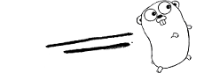
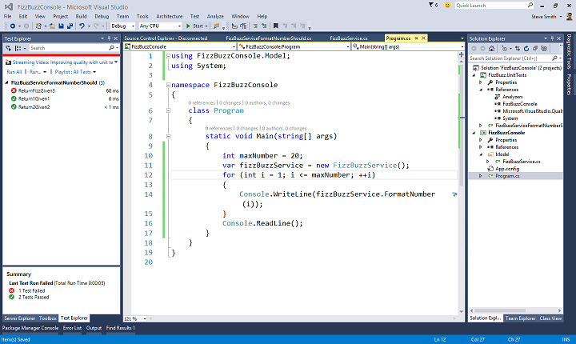

class: middle, center
#GoLang BrownBag

By Alan Gawthorpe

---
class: middle, center
# A bit of History
---
## ???
```ada
procedure FizzBuzz is

begin

   for i in 1 .. 100 loop

      Integer_Text_IO.Put (i);

      if i rem 15 = 0 then
         Text_IO.Put (" FizzBuzz");
      elsif i rem 5 = 0 then
         Text_IO.Put (" Buzz");
      elsif i rem 3 = 0 then
         Text_IO.Put (" Fizz"); 
      end if;    

      Text_IO.Skip_Line;

   end loop;

end FizzBuzz;
```
---
## ???
```c
int main(void)
{
    int i;
    for(i=1; i<=100; ++i)
    {
        if (i % 3 == 0)
            printf("Fizz");
        if (i % 5 == 0)
            printf("Buzz");
        if ((i % 3 != 0) && (i % 5 != 0))
            printf("number=%d", i);
        printf("\n");
    }

    return 0;
}
```
---
## ???

```cs
public void DoFizzBuzz()
{
    for (int i = 1; i <= 100; i++)
    {
        bool fizz = i % 3 == 0;
        bool buzz = i % 5 == 0;
        if (fizz && buzz)
            Console.WriteLine ("FizzBuzz");
        else if (fizz)
            Console.WriteLine ("Fizz");
        else if (buzz)
            Console.WriteLine ("Buzz");
        else
            Console.WriteLine (i);
    }
}
```

---
## ??? 

```python
def fizzbuzz(n):

    if n % 3 == 0 and n % 5 == 0:
        return 'FizzBuzz'
    elif n % 3 == 0:
        return 'Fizz'
    elif n % 5 == 0:
        return 'Buzz'
    else:
        return str(n)

print "\n".join(fizzbuzz(n) for n in xrange(1, 21))
```
---
## ???
```js
function fizzbuzz(i) {
  if (i % 5 === 0 && i % 3 === 0) {
    return 'FizzBuzz';
  } else if (i % 3 === 0) {
    return 'Fizz';
  } else if (i % 5 === 0) {
    return 'Buzz';
  } else {
    return i
  }
};
for (var i = 1; i <= 20; i++) {
  console.log(fizzbuzz(i) + '\n')
}
```

---
## GoLang

```go
func fizzbuzz(num int) string {
    if num%15 == 0 {
        return("FizzBuzz")
    } else if num%3 == 0 {
        return("Fizz")
    } else if num%5 == 0 {
        return("Buzz")
    } 
    return(strconv.Itoa(num))
}

```

---
# So What

Syntactically they're all pretty much the same...

---
# Well...

Ada - statically typed, verbose, mission critical stuff, pretty dull.

C - static...with loop holes.  Low level, manage you own memory, etc.

C# - static with garbage collection. C# vs Java.

Python - dynamic types.  Flexible, no less brackets! Bit slow.

Javascript - dynamic.  Callbacks...

Go - static...but it can feel pretty dynamic.  Fast, even with GC.

C++ - really complicated language, bugger to build...
---
# Google Background

 Rob Pike - Worked at Bell labs.  Co-creator of UTF-8?! 

 Robert Griesemer - some Java stuff 

 Ken Thompson - designed and implemented Unix and B (predecessor of C) 

  
--
Renée French

---
# Context
## 2007

* C++, Python, Java
* Single repository
* Complex build system


---
# Key Features
Too many to list but here is a few I thought worth mentioning:
* Structure of working directories, etc
* Compilation is very picky - imports, documentation, unused variables
* No inheritence
* Interface implementation is implicit
* Gargage Collection
* Error handling
* Go routines and channels

---
# Interfaces

```go
type geometry interface {
    area() float64
    perim() float64
}

type rect struct {
    width, height float64
}
func (r rect) area() float64 {
    return r.width * r.height
}
func (r rect) perim() float64 {
    return 2*r.width + 2*r.height
}

func measure(g geometry) {
    fmt.Println(g)
    fmt.Println(g.area())
    fmt.Println(g.perim())
}
func main() {
    r := rect{width: 3, height: 4}
    
    measure(r)
}
```

---
# Example
---
exclude: true
# Tool Bloat



---
#Other Examples

##Erlang
```erlang
fizzbuzz() ->
	F = fun(N) when N rem 15 == 0 -> "FizzBuzz";
		(N) when N rem 3 == 0  -> "Fizz";
		(N) when N rem 5 == 0  -> "Buzz";
		(N) -> integer_to_list(N)
	end,
[F(N)++"\n" || N <- lists:seq(1,100)]
```

##JS - Paul Irish
```js
for (var i = 1; i <= 100; i++) {
  var f = i % 3 == 0, b = i % 5 == 0;
  console.log(f ? b ? "FizzBuzz" : "Fizz" : b ? "Buzz" : i);
}
```

---
### Chapter 1.2

Some content

---
## And so on...